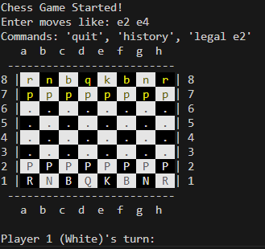

# Command-Line Chess Game Engine 🏁

A fully-featured, object-oriented chess game implemented in Java. This project serves as a strong backend engine with a clean command-line interface, demonstrating robust logic for all standard chess rules.



---

## 🌟 Features

### Core Game Logic
* ✅ **Complete Rule Set:** Implements all piece movements, including special moves like Castling, En Passant, and Pawn Promotion.
* ✅ **Endgame Detection:** Accurately detects Check, Checkmate, and Stalemate conditions.
* ✅ **Move Validation:** Robustly prevents any illegal moves and ensures players cannot place their own king in check.

### Interactive Terminal
* 🎨 **Colored Board:** Uses ANSI escape codes for a clear and visually appealing board in modern terminals.
* 🟢 **Move Highlighting:** The last move is highlighted to make gameplay easy to follow.
* 📚 **Game Records:** View a complete history of moves or see all legal moves for a specific piece.

---

## 🚀 Quick Start
### Installation & Build

1.  **Clone the repository:**
    ```sh
    git clone https://github.com/charanmannem/Command-Line-Chess-Game-Engine.git
    cd Command-Line-Chess-Game-Engine
    ```

2.  **Compile the Java files:**
    ```sh
    javac ChessMain.java
    ```

3.  **Run the game:**
    ```sh
    java ChessMain
    ```

---

## 🎯 How to Play

* **Make a Move:** Enter moves in algebraic notation (e.g., `e2 e4`).
* **Show Legal Moves:** Type `legal` followed by a square (e.g., `legal e2`).
* **View History:** Type `history` to see all moves played.
* **Quit Game:** Type `quit` to end the game.

---
